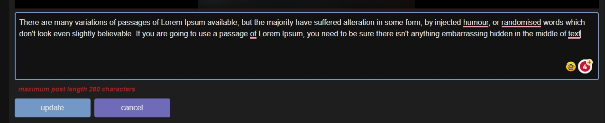
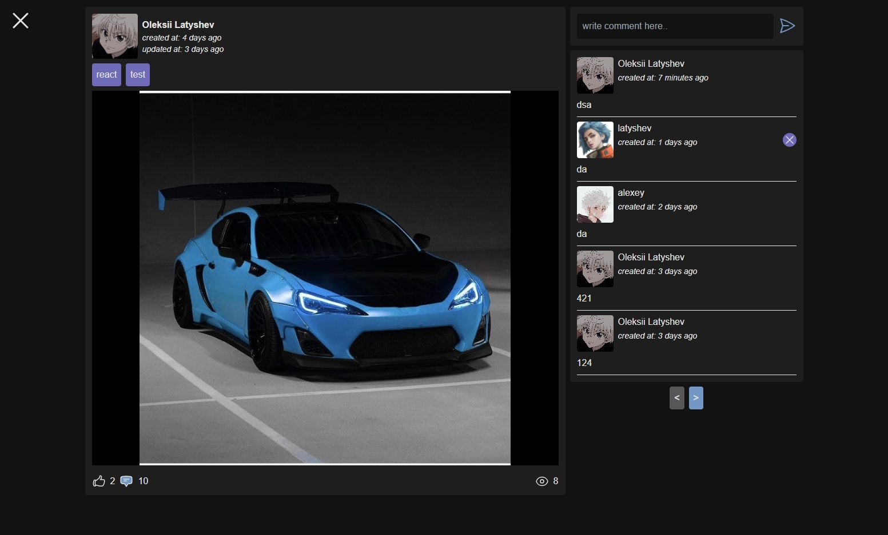
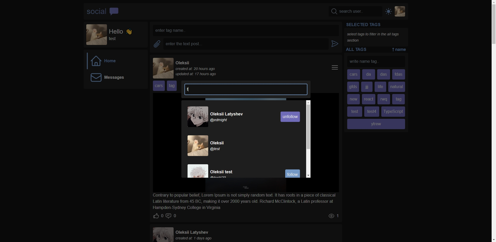
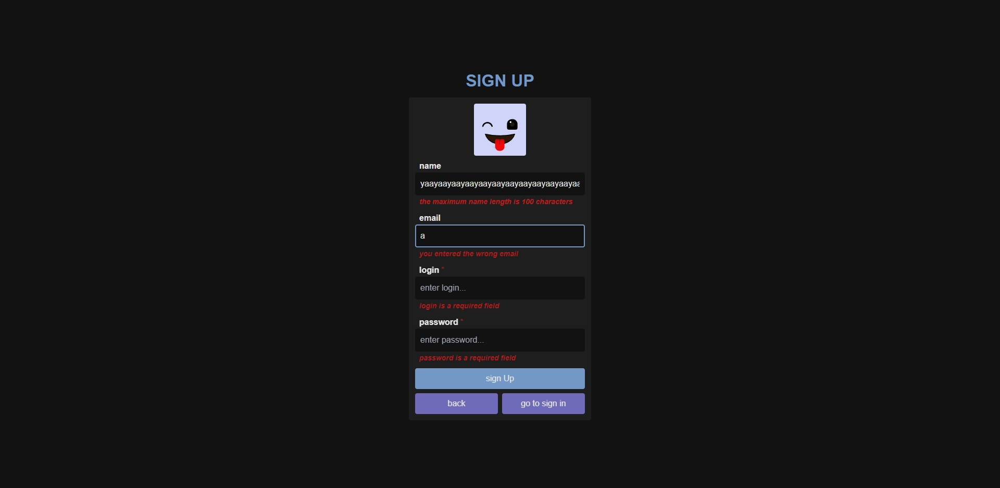

# [social](https://social-latyshev.vercel.app/)

This application is a personal project in which I aimed to create a social network with its basic features implemented, while using new tools that were unfamiliar to me during the development process.

[](https://social-latyshev.vercel.app/)

## Tech Stack

- **Client Framework:** [React](https://react.dev/)
- **Server Framework:** [Express.js](https://expressjs.com/)
- **Styling:** [Tailwind CSS](https://tailwindcss.com)
- **ORM:** [Prisma](https://www.prisma.io/)
- **State Management:** [Redux Toolkit](https://redux-toolkit.js.org/)

## Features to be implemented

- [x] Authentication flow using **[JWT tokens](https://jwt.io/)** with **[RTK Query](https://redux-toolkit.js.org/rtk-query/overview)**
- [x] Client validation with **[Zod](https://zod.dev/)**
- [x] Generating API documentation using **[Swagger](https://swagger.io/)**
- [x] Using the **[airbnb](https://www.npmjs.com/package/eslint-config-airbnb)** config for eslint on the client
- [x] A little API testing with **[Jest](https://jestjs.io/)**

## Running Locally

1. Clone the repository

   ```bash
   git clone https://github.com/EDMIGHT/social.git
   ```

2. Install dependencies to server folder **(relative to root)**

   ```bash
   cd server
   yarn
   ```

3. Copy the `.env.example` to `.env` and update the variables **(server folder)**.

   ```bash
   cp .env.example .env
   ```

4. Push the database schema **(server folder)**.

   ```bash
   yarn push
   ```

5. **(optional)** Filling the database **(server folder)**.

   ```bash
   yarn seed
   ```

6. Start the development server **(server folder)**

   ```bash
   yarn dev
   ```

7. Install dependencies to client folder **(relative to root)**

   ```bash
   cd client
   yarn
   ```

8. Copy the `.env.example` to `.env` and update the variables **(client folder)**.

   ```bash
   cp .env.example .env
   ```

9. Start the development server **(client folder)**

   ```bash
   yarn dev
   ```

## How do I deploy this?

- **The client part is hosted on:** [Vercel](https://vercel.com/docs/deployments/overview)
- **The server part is hosted on:** [Microsoft Azure](https://azure.microsoft.com/en-us)
- **The database is hosted on:** [Vercel](https://vercel.com/docs/storage/vercel-postgres)
- **Media files are hosted on:** [Cloudinary](https://cloudinary.com/documentation/node_integration)

## License

Licensed under the MIT License. Check the [LICENSE](./LICENSE.md) file for details.

## More about applications

- [Post feed (Home page)](#post-feed-home-page)
- [Filtering posts by tags](#filtering-posts-by-tags)
- [Post and work with it](#post-and-work-with-it)
- [Post creation](#post-creation)
- [Post update](#post-update)
- [Post page](#post-page)
- [Profile](#profile)
- [Profile update](#profile-update)
- [User follow/unfollow](#user-followunfollow)
- [User search](#user-search)
- [Sign In / Sign up](#sign-in--sign-up)
- [Theme switcher](#theme-switcher)

## Project demo

### Post feed (Home page)

The post feed (Home page) is a page that will display the posts of all users of the social network sorted by the date created.

#### Post feed with unauthorized user

An unauthorized user can view the post feed, as well as filter posts for existing tags, but he does not have the ability to interact with them, only viewing is available


#### Post feed with authorized user

On the post feed, an authorized user can create his own posts, create tags for the post (if there is none yet), and he is also shown in the post menu the presence (highlighted in blue) of a like or comment under this post


#### Post feed mobile adaptation

To provide a more convenient design, the filtering of posts by tags in mobile adaptation has been hidden and appears when you click on the "filter tags" button


[Back to contents ⬆](#more-about-applications)

### Filtering posts by tags

Implemented the ability to filter posts by their tags, to display a post in the feed, it will be enough to have one tag from the list of tags by which filtering occurs. Also, this list of tags for filtering is local data and will be saved to local storage to save the selected tags after reboot or authorization / registration

#### Choosing tags to filter posts

To select a tag for filtering, you need to click on a tag in the list of all tags, after which it will disappear from all and be transferred to the selected section, if you click on the tag in the selected tags section, it will be removed from the list by which filtering occurs and will be displayed again in the section with everyone


#### Tag search

In the section with all tags, there is a field where the user can write the name of the tag and the search will be dynamically performed and its result will be displayed in the same section for which, namely, tags that have such a combination of letters. Also, to ensure less load on the server, a debounce was added using the [lodash debounce library](https://www.npmjs.com/package/lodash.debounce)


#### Tag sorting

Opposite the name of the section of all tags there is a button "name" when pressed, the tags are sorted by their name, the sorting direction is displayed as an arrow direction inside this button


[Back to contents ⬆](#more-about-applications)

### Post and work with it

The post has its own menu, which displays the number of likes, comments and views of this post (a view is considered if an authorized user opens the post)


#### Post tags

Under the author of the post, there can be a list of tags that the author indicated for him by which this post will be displayed, but if we click on this tag, this tag will be added to the list of tags by which posts are filtered


#### Like post and its indications at the post

The ability to like a post is available only to an authorized user and is carried out by clicking on the button in the form of a like. Below are screenshots of the post to demonstrate the indication without a like and comment (I don't have it highlighted in blue) and with a like and comment (highlighted in blue) of the current user. About comments are described in section [Post comments and working with them](#post-comments-and-working-with-them)


#### Post control

To control the author of his posts, a button was created that is displayed only for an authorized user and only for his posts in which we can edit or delete a post


[Back to contents ⬆](#more-about-applications)

### Post creation

Creating a post is available in the feed of all posts and when opening a user profile (only on the profile of the one under which the authorization was made). For the very creation of a post, only the presence of a picture or text (280 characters maximum) is mandatory, in the absence of both parameters an error will be generated, tags can be specified, but you can not.


#### Choosing tags when creating a post

When creating a post, we can assign certain tags to it so that it can be found when filtering behind them. To do this, in the first field of the form (where they are asked to enter the tag name), we need to start typing the name of the required tag, upon entering which requests will be sent to the server (debounce was used to reduce load) and dynamically display the search result in a pop-up window below the input field suitable tags. You can verify that the information displayed is correct by viewing the all tags section. If the required tag was found, then to add it to the post it will be enough to click on it and vice versa, if this tag is no longer needed, then when you click on it, it will be removed from the list of tags for this post.


If the required tag is not available, then in the same pop-up window there is an opportunity in the form of a "create your" button, which activates the tag creation form (the entered text will automatically be transferred to the form during the search)


It should also be noted that the tag name must be unique and you cannot create 2 tags with the same name. In case of an attempt, a pop-up message will be activated at the bottom center of the screen, which will inform the user that such an operation is impossible.


The positive scenario for creating your own tag will be that the tag will be added to the post, and will also be displayed in the section of all tags


#### Uploading an image for a post

The user can upload their ONE image for this post, and this feature can be activated by clicking on the paperclip icon to the left of the text input field, which will open a window where the user can select an image (the user can select multiple, but only the first one will be taken into account). The image is uploaded to the server using [multer technology](https://www.npmjs.com/package/multer).

- If the user wants to delete the picture, then a cross button has been added to the right in the upper corner of the picture
- If the user wants to change the picture, then you need to click on the paperclip again and select another picture


#### Post creation result


[Back to contents ⬆](#more-about-applications)

### Post update

To change the post change, we need to open the [the post control menu](#post-control) and select the “Edit” item, after which we will see a page where we can change add / remove the tag, change / delete the image, change the text of the post itself. When you click on the cross or the background of this window, we will return to the previous window (from where we got to this page). It is also worth noting that the changes that occur to the post before it is sent are local and if cancel is pressed, they will not be saved (including changing the image, tags, etc.), only the tag will be saved in the general database, but not post, if it was created when the post was modified


#### Change post image

To change the picture of the post, we need to click on the pencil icon, after which a window will open for uploading a photo, or if we need to delete the picture, then the cross icon. The result of changing the picture is shown in the screenshot.


#### Changing post tags

This is still the same component as when creating a post, so the work is identical: enter a title, select or create a tag / click on a tag in the list next to the post to delete it


#### Post change result

Add the text fish in the lower field specially designated for this (the length should be no more than 280 characters) and press the button to apply the changes (Update). The screenshots will show the post in the post feed after the changes that were made for the demo and the validation screenshot if we entered text over 280 characters.



If successful, we will be redirected to the previous page, from where we got to the editing page, and it is also worth noting that new information will be added to the post title in the form that the post was changed and how long ago it was changed (with subsequent changes, the time will also be updated to the current)


Comparing the title of posts that have been modified and that have not been modified after they were created


#### Post update mobile adaptation


[Back to contents ⬆](#more-about-applications)

### Post page

Clicking on a post in the feed opens that post's page, where we still have the post menu available, manage it, and can now view and post comments (if there is an authorized user). When you click on the cross or just the background outside the post and comments, we will return to the previous page (relative to the one from where the person got to this page). Also, when the post page is opened by an authorized user, the view count of this post (in the post menu with an eye icon) will be increased by one unit, the next time the same post is opened by the same user, the number of views will still increase

#### Post page with unauthorized user


#### Post page with authorized user


#### Post page mobile


[Back to contents ⬆](#more-about-applications)

### Post comments and working with them

Any user on the [post page](#post-page) is able to view the comments left under this post (as well as with likes, if the user left at least 1 comment under it, the comment icon will turn blue)

#### Create a comment

Authorized user can leave a comment under the post, namely in the form of which is located above the list of all comments


#### Deleting comments

The author of the post can delete any comment under his post and at the same time the author of the comment itself can only delete it.

The screenshot below shows the list of comments when viewed on behalf of the author of the post (Oleksii Latyshev), where we have the opportunity to delete all comments (button with a cross next to the comments)


The screenshot below shows a list of comments when viewed on behalf of the author of the comment (latyshev), where we have the opportunity to delete comments only by the comment created by him and no one else (button with a cross next to the comments)


[Back to contents ⬆](#more-about-applications)

### Profile

Each user has his own profile, where you can see his feed of posts, the feed of posts that he liked, his following and followers, including their number, namely using the buttons in the profile header. Pagination is made in the form of arrows at the bottom of the feed.

#### Profile with posts created by this user

On this tab, we can see all the posts that have been created by this user. We can open this tab by clicking on the posts button in the profile header (the current tab is displayed in blue). If we have opened our profile, then the component for creating posts is also available to us and it works exactly the same as on the home page.

Below is a screenshot of the current user's profile, namely the tabs with posts.


Below is a screenshot of the profile of another user, namely the tabs with posts.


#### Profile with liked posts

On this tab, you can see the posts that the user liked, there is no difference between users (current or others). If in this list we remove the like from the post, it will automatically disappear


#### Profile with a list of following and followers

These are two similar profile tabs, the difference being that the following tab shows the users that the profile owner has followed, while the followers tab shows users that have followed the profile owner. We have the opportunity, when clicking on a picture or information about a user in the list, to get to his profile, or when clicking on the button opposite, follow / unfollow from him. If the profile is ours, then when you click on unfollow in the following tab, the user will be automatically removed.


[Back to contents ⬆](#more-about-applications)

### Profile update

On the profile of the current user in the upper right in the profile header there is a button with a pencil icon, when clicked on, we will change the profile header to a form where we can change the current information about the user, namely his picture, name, email

Before activating edit mode


After activating edit mode


This form has a validation that will not skip the data if the user entered more than 100 characters, we can also upload a new avatar on it. After confirming the user change, the information in the entire application will be automatically updated.

Before profile update


After profile update


#### Profile update form mobile


[Back to contents ⬆](#more-about-applications)

### User follow/unfollow

following or unfollowing to a user is carried out from the corresponding button on the profile or opposite the user information in the lists with users. The functionality itself does not affect the feed of posts. When clicking on a subscription or unfollowing from a user, the information in the profile will be automatically updated both for the one who followers and for the one who is followed to.


[Back to contents ⬆](#more-about-applications)

### User search

Implemented the ability to search for users by their login, the search is not strict. To activate the search, in the application header, click on the input field (>640px device) or on the magnifying glass icon (<640px device). This functionality does not depend on user authorization and is publicly available.


When you click on the trigger described above, we will open a search field in the middle of the screen where we need to enter the user's login. The focus on this field will be automatically set when this window is opened.


After we enter the value, a request will be sent to the server (debounce is used to reduce the load) and the result of the user's search will be displayed at the bottom. The number of users received from such a search is limited to 10. It is also worth noting that the same user component is used as on [the page of following and followers](#profile-with-a-list-of-following-and-followers), therefore, all the same functionality is available in the form of a transition to the user profile in case of clicking on the area pictures and information about it, or the [follow/unfollow functionality](#user-followunfollow) when you click on the button opposite.



If during the search no users were found matching the entered value, a corresponding message will be displayed.


#### User search mobile adaptation


[Back to contents ⬆](#more-about-applications)

### Sign In / Sign Up

The functionality of authorization and registration has been implemented, the security of which is also provided by data validation on the server and client sides. The password in the database is stored in encrypted form using [bcryptjs](https://www.npmjs.com/package/bcryptjs).

User authentication is performed on the server using the [JWT tokens](https://jwt.io/), namely the access token. The access token has a lifespan of 24 hours and is not stored in the database, after which it will need to be updated with a refresh token, which in turn does not have a lifespan and is already stored in the database for each user.

#### Sign Up

On the sign Up form, the user can upload his picture or leave the picture that the [DiceBear Fun Emoji](https://www.dicebear.com/styles/fun-emoji) service generates based on the login. Required fields on the form are marked with a red asterisk and validation is additionally applied to them for the minimum number of characters. From this form, we can go to the sign In form or return to the previous page from where we got to this one.

Below is a screenshot of the sign Up form without the entered data


Below is a screenshot of the sign Up form with a demonstration of validation


Below is a screenshot of the sign Up form with filled in test data, where it is worth noting that the picture has been changed in accordance with the login (the login is a seed for the picture and therefore it will not be changed)


Below is a screenshot of the sign Up form in the mobile version.


#### Sign In

The login form has a login and password check, namely restrictions on the minimum number of characters and the maximum. From this form, we can go to the sign up form or return to the previous page from where we got to this one.

Below is a screenshot of the sign In form with a demonstration of validation


Below is a screenshot of the sign In form in the mobile version.


#### Logout

In case of a successful login or registration, we can log out of our account using popup in the profile header.


[Back to contents ⬆](#more-about-applications)

### Theme switcher

Implemented the ability to switch the theme, the button itself is located in the application header and the icon depends on the current theme (sun or moon). When entering the application, a check is made for the selected user theme in the browser and, based on it, the initial one is set. In order for the selected theme to be saved by the user, the theme is saved to local storage.

Below are screenshots of applications of different pages in a white theme.

Homepage(post feed):


Profile:


Profile edit:


User search:


Post page:


Post edit:


Sign In:


Sign Up:


[Back to contents ⬆](#more-about-applications)
